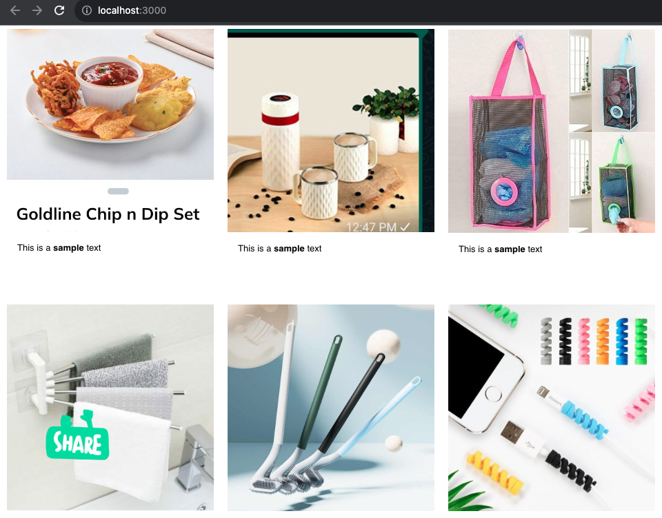

# photo-collage

This is a react app to display photos from a directory "<root>/images/" into multi-column layout. The app also supports in-line editing of content below each of the photos.

The in-line edited content for images is persisted in local-storage of the browser. So the content doesn't get lost on reload.

## Running locally

- Put some images or subfolder with images, at location "src/images"
- Check the number of columns rquired for display from config "src/config/config.json"

- Install node dependencies

`npm install`

- Start the app locally

`npm run start`
